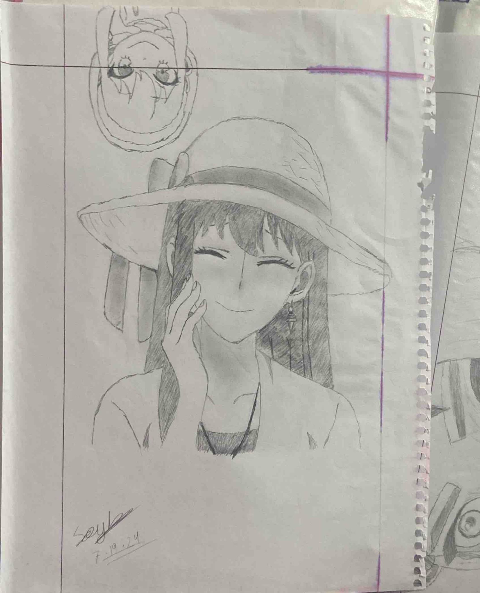

# Sayhan's Artworks 🎨

Welcome to my little corner of the internet where I share some of my sketches. Below are a few pieces I've worked on. Feel free to browse, critique, or even leave a star if you like what you see! 😊

## Artworks

### 1. Yor Forger (Spy x Family) - `/yor/1.jpg`

**Description:** This sketch captures Yor Forger from "Spy x Family," the ever-cool assassin with a heart of gold. Tried to focus on her elegant yet deadly aura.

### 2. Valorant Cinematic Scene - `/valorant scenematic/2.png`

**Description:** Inspired by the intense cinematics of Valorant, this piece attempts to capture the adrenaline-packed atmosphere that makes the game so thrilling.

### 3. Nakahara Chuuya (Bungou Stray Dogs) - `/nakahara chuuya/6.jpg`

**Description:** This one's for the Bungou Stray Dogs fans! A sketch of Nakahara Chuuya, the hot-headed, hat-loving Port Mafia executive with gravity-defying abilities.

### 4. Howl Jenkins Pendragon (Howl's Moving Castle) - `/howl jenkins pendragon/6.jpg`

**Description:** Who doesn't love Howl? This sketch portrays the enigmatic wizard, Howl Jenkins Pendragon, from Studio Ghibli's classic "Howl's Moving Castle."

---

Thanks for checking out my art! You can find more of my work on [GitHub](https://github.com/sayhan1610/artworks). If you enjoyed these, consider watching the repository for future updates. ✨
